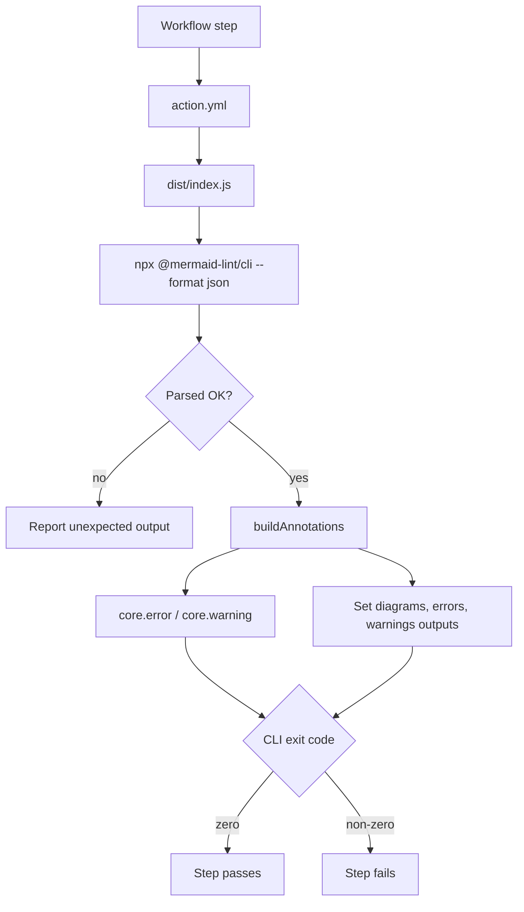

# mermaid-lint-action

Validate Mermaid diagrams in your CI pipeline with **inline PR annotations** — errors appear directly on the diff lines where they occur.

**[mermaid-lint →](https://github.com/jasonworden/mermaid-lint)**

## Usage

```yaml
- uses: jasonworden/mermaid-lint-action@v1
```

### Full example

```yaml
name: Lint
on: [push, pull_request]

jobs:
  mermaid:
    runs-on: ubuntu-latest
    steps:
      - uses: actions/checkout@v7
      - uses: jasonworden/mermaid-lint-action@v1
        with:
          files: 'docs/**/*.md **/*.mmd'
          strict: true
```

## How it works



The action shells out to `@mermaid-lint/cli`, reads its JSON report, and
converts each finding into a GitHub annotation anchored to the right source
line. The CLI's exit code — not the annotation count — decides pass or fail.

## Inputs

| Input | Required | Default | Description |
|---|---|---|---|
| `files` | No | *(git-tracked *.md / *.mmd / *.mdx)* | Space-separated glob patterns to validate |
| `strict` | No | `false` | Pass `--strict`, promoting advisory warnings to failures |
| `version` | No | `^0.35.1` | npm version range for `@mermaid-lint/cli` |
| `working-directory` | No | `.` | Directory to run mermaid-lint from |

### About `version`

The CLI is pinned by default so that a floating action ref like `@v1` stays
reproducible — otherwise a new CLI release could change the outcome of a build
whose own inputs never moved. To track the latest CLI instead, pass an empty
string:

```yaml
- uses: jasonworden/mermaid-lint-action@v1
  with:
    version: ''
```

### About `strict`

`strict` maps to the CLI's `--strict` flag. It is not the only thing that can
fail a run: rules whose own severity is `error` — `duplicate-ids`, for
instance — already exit non-zero without it. Warnings are annotated either
way, so a failing run always has something pointing at its cause.

## Outputs

| Output | Description |
|---|---|
| `diagrams` | Total diagrams checked |
| `errors` | Number of diagrams with errors |
| `warnings` | Number of semantic warnings |

### Use outputs

```yaml
- uses: jasonworden/mermaid-lint-action@v1
  id: lint
- run: echo "Found ${{ steps.lint.outputs.errors }} errors"
```

## Annotations

Errors appear as inline annotations on the PR diff:

```
docs/api.md:42: error: Expecting 'SPACE', got: '->'
```

## Requirements

Requires Node.js 24 (provided by the GitHub-hosted runners).

## Development

```bash
npm ci
npm test              # unit tests: offline, no network
npm run verify-dist   # rebuild and fail if the committed bundle drifted
npm run test:integration  # runs the built bundle against the real CLI
```

`dist/` is a committed [ncc](https://github.com/vercel/ncc) bundle, because
GitHub runs the bundle directly rather than installing dependencies. Any change
under `src/` therefore needs `npm run build` committed alongside it; CI fails
the build if the two drift apart. It is marked `linguist-generated` so pull
request diffs collapse it — a dependency bump rewrites most of the 1 MB file.

`npm test` is unit-only so it stays fast and offline. The integration tests
run the built bundle against the real CLI and assert that annotations land on
the right source lines, deriving the expected line by searching the fixture
rather than hard-coding it. CI also runs the action against its own diagrams
via `uses: ./`, including a deliberately broken fixture it expects to fail.
That is not circular — the action depends on the `@mermaid-lint/cli` npm
package, which has no dependency back on this repository.

## Releasing

Releases are driven by `package.json`'s version, bumped in the PR itself:

1. Bump the version in your PR — `npm version patch|minor|major --no-git-tag-version`.
2. Merge to `main`.
3. The release workflow tags it, publishes the GitHub Release, and force-moves
   the major alias so `@v1` follows along.

No tag is pushed by hand, and no workflow commits back to `main`.

A PR that changes anything consumers actually run, without bumping the version,
fails the Version Check job — otherwise the merge would quietly produce no
release at all. Docs, CI, tests, and scripts are exempt; everything else
requires a bump, so a newly added released path fails closed rather than
silently skipping its release.

Version Check only blocks a merge if it is configured as a **required status
check** in branch protection. That setting lives in repository settings, not in
this repo, so nothing here can enforce or detect it.

Bumping the major version starts a new alias (`v2`) and leaves the previous one
pinned to its last release, so existing `@v1` consumers keep working.

## License

[MIT](LICENSE)
