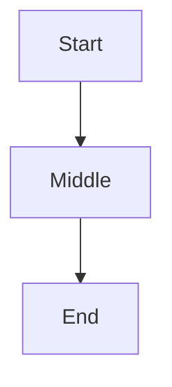
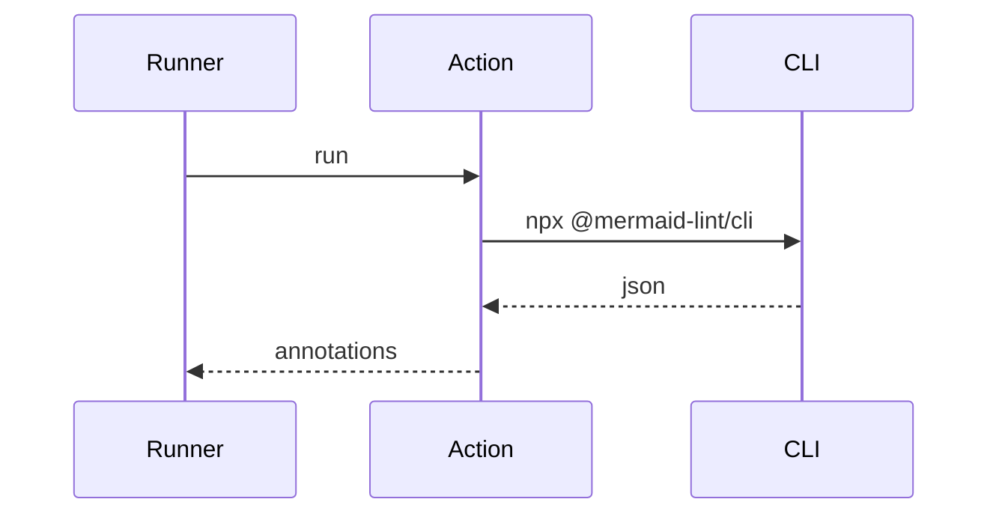

# Valid fixture

Every diagram in this file must parse cleanly and emit no warnings. The
dogfood job in CI lints it with the action itself and expects success.

```mermaid
flowchart TD
    A[Start] --> B[Middle]
    B --> C[End]
```

```mermaid
sequenceDiagram
    Runner->>Action: run
    Action->>CLI: npx @mermaid-lint/cli
    CLI-->>Action: json
    Action-->>Runner: annotations
```
