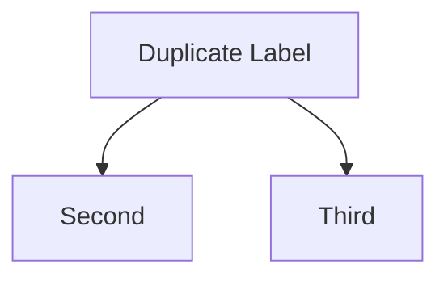

# Warning fixture

Do not fix the diagram below — node `A` is declared twice on purpose, which
trips the `duplicate-ids` rule. That rule's severity is `error`, so the CLI
fails the run with or without `--strict`; the integration test uses this to
prove the warning is still annotated when `strict` is off.

The expected line is found by searching for `A[Duplicate Label]`, so moving the
diagram within this file is fine.

