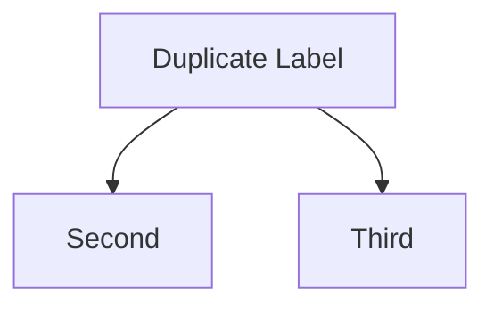

# Intentional duplicate-ids fixture — do not fix
Tests assert the warning lands on line 7; do not add lines above the fence.

```mermaid
flowchart TD
    A[First] --> B[Second]
    A[Duplicate Label] --> C[Third]
```
